# Гайд владельца: админ-панель Codex Studio

Эта инструкция — для владельца сайта <https://codex.promo/>. Никаких
технических знаний не нужно: всё делается мышкой в браузере.

Админка живёт по адресу **<https://codex.promo/admin/>**. Она не видна
посетителям и закрыта от поисковиков; попасть внутрь может только человек
с правами на репозиторий `Gorgutc/codex`.

Главный принцип: **все правки сначала копятся в черновике** (жёлтая надпись
«несохранённые изменения» в шапке). На сайт они попадают только после нажатия
кнопки «Опубликовать» — до этого можно спокойно экспериментировать и смотреть
результат в предпросмотре.

---

## 1. Вход

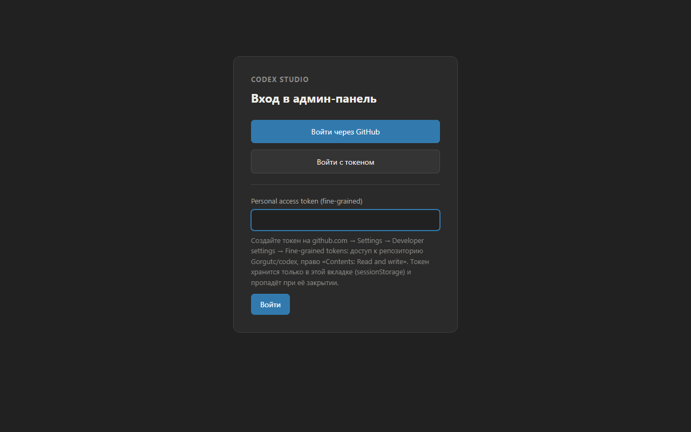

Есть два способа — оба ведут в одну и ту же админку.

### Способ A: «Войти через GitHub» (обычный)

1. Нажмите «Войти через GitHub».
2. Во всплывающем окне GitHub попросит подтвердить доступ — нажмите
   «Authorize». Окно закроется само, и вы окажетесь в списке кейсов.
3. Если окно не открылось — разрешите всплывающие окна (pop-up) для
   codex.promo в настройках браузера и попробуйте ещё раз.

Этот способ работает после однократной настройки OAuth-приложения
(см. чек-лист в `docs/agent/admin-panel/handoff.md`, журнал итерации D).

### Способ B: «Войти с токеном» (запасной)

Если OAuth недоступен, подойдёт персональный токен GitHub:

1. На GitHub: Settings → Developer settings → Fine-grained tokens →
   «Generate new token».
2. Доступ: только репозиторий `Gorgutc/codex`, право
   «Contents: Read and write». Срок — на ваше усмотрение.
3. Скопируйте токен, в админке нажмите «Войти с токеном», вставьте, готово.

Токен хранится только в текущей вкладке: закрыли вкладку — токен забыт,
это нормально. При следующем входе вставьте его заново (или создайте новый).

---

## 2. Правка текста кейса (RU/EN)

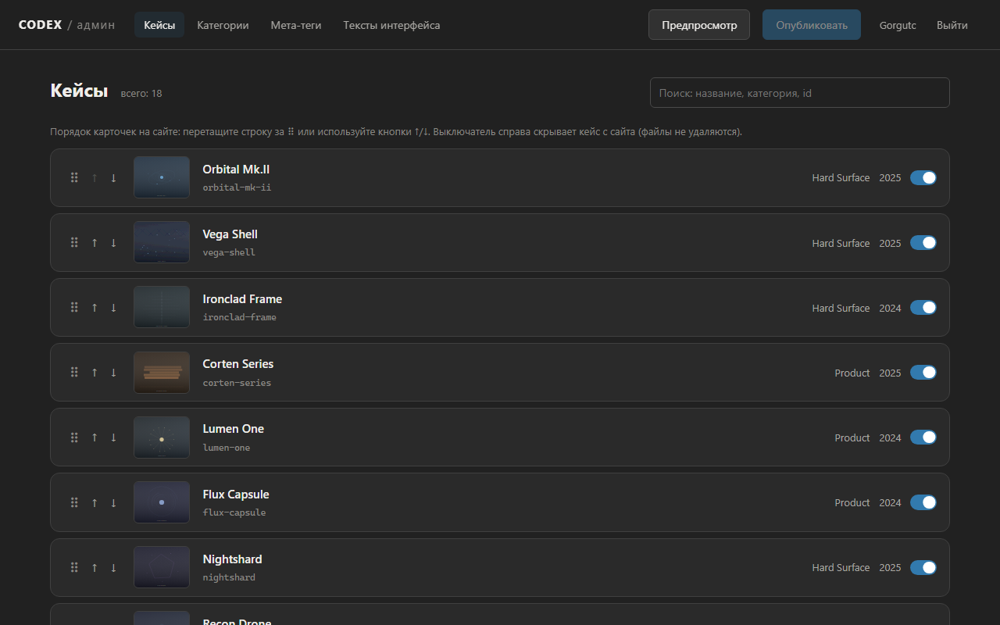

1. Раздел «Кейсы» → найдите нужный кейс (поиск понимает название, категорию
   и id) → кликните по строке.
2. Все тексты лежат в два столбца: слева EN, справа RU — правьте любой,
   вторая колонка всегда перед глазами, чтобы переводы не разъезжались.
3. Черновик сохраняется сам по мере набора текста — в шапке появится
   «несохранённые изменения». Можно уйти на другой экран и вернуться,
   правки не потеряются (они живут до публикации или до закрытия вкладки).

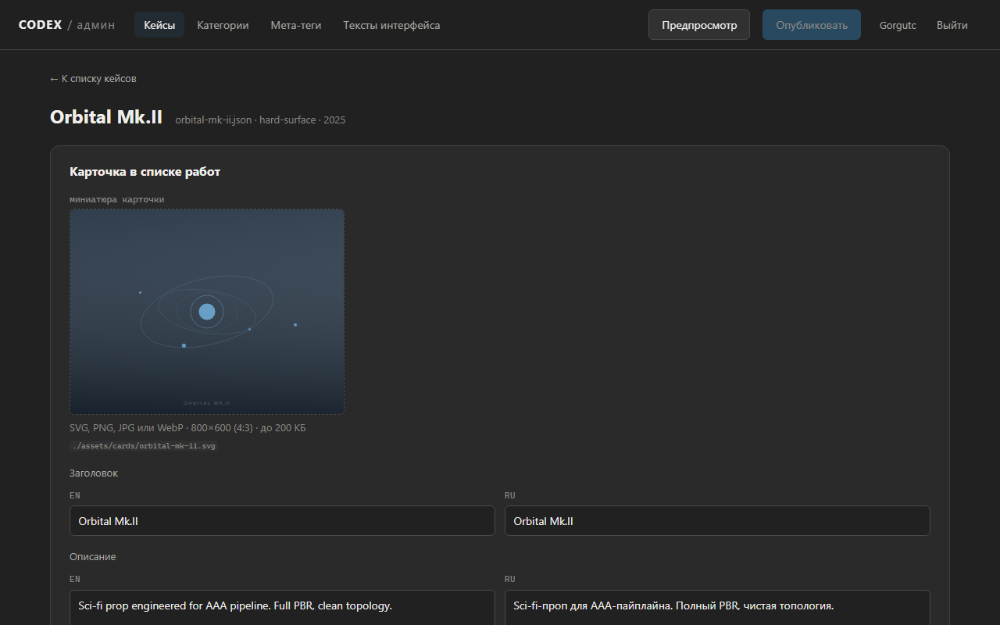

Пустыми обязательные поля оставить не получится: при публикации админка
подсветит проблемное поле красным и напишет, что именно заполнить.

---

## 3. Замена фото и загрузка видео

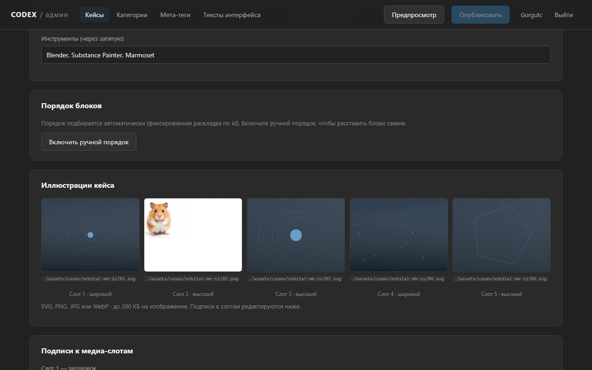

### Фото и иллюстрации

1. В редакторе кейса найдите блок «Иллюстрации кейса» (или миниатюру в самом
   верху, или постеры motion-блоков ниже).
2. Перетащите новый файл прямо на текущую картинку — или кликните по ней и
   выберите файл. Форматы: SVG, PNG, JPG, WebP; лучше держаться до 200 КБ.
3. На слоте появится бейдж «новый файл», а в шапке — жёлтое предупреждение:
   загруженные файлы живут в памяти вкладки и **не переживут перезагрузку
   страницы**. Опубликуйте их или будьте готовы загрузить заново.

Старые файлы с сайта не удаляются — новая картинка получает новое имя,
поэтому сломать что-то заменой невозможно.

### Видео: короткие лупы и Vimeo

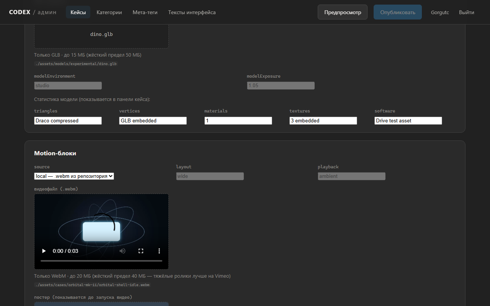

У кейсов с движущимися блоками («Motion-блоки») два источника видео:

- **local** — короткий зацикленный ролик `.webm` прямо в репозитории.
  Перетащите файл в зону «видеофайл». До 20 МБ — отлично; тяжелее —
  админка предупредит, что лучше Vimeo. Файлы больше 40 МБ загрузить
  нельзя — для них используйте Vimeo.
- **vimeo** — тяжёлые ролики. Залейте видео на Vimeo вручную, затем в блоке
  переключите источник на «vimeo» и вставьте ссылку на ролик (подойдёт любая
  ссылка vimeo.com или просто цифровой ID). Админка сама распознает ID и
  покажет «Распознан ID: …». Скрытые ролики со «секретной» ссылкой
  (vimeo.com/123/abcdef) пока не поддерживаются — нужен обычный ролик.

Поля layout и playback менять нельзя — ими управляет раскладка сайта.

---

## 4. Перестановка блоков и карточек

### Порядок карточек на главной

В списке кейсов перетащите строку за ручку ⠿ (или используйте кнопки ↑/↓ —
они удобны с клавиатуры). Порядок сохранится в черновик и применится на
сайте после публикации. Во время поиска перестановка отключена — сначала
очистите строку поиска.

### Порядок блоков внутри кейса

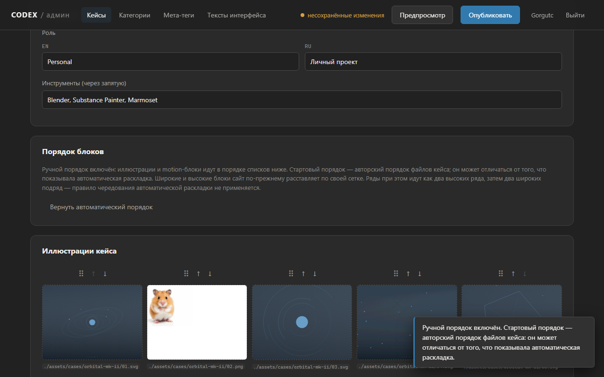

По умолчанию порядок иллюстраций внутри кейса собирает сам сайт — у каждого
кейса своя фиксированная «перетасовка», она никогда не меняется сама по себе.
Это режим «автоматический».

Если хочется расставить блоки самим:

1. В редакторе кейса найдите «Порядок блоков» → «Включить ручной порядок».
2. У слотов и motion-блоков появятся ручки ⠿ и кнопки ↑/↓ — двигайте.
   Подпись и цвет фона переезжают вместе с картинкой, ничего не разъедется.

Два важных момента простыми словами:

- **Стартовый порядок — не тот, что на сайте.** Ручной режим начинает с
  «авторского» порядка файлов кейса, а не с того, что показывала
  автоматическая перетасовка. Проверьте результат в предпросмотре.
- **Широкий или высокий — решает позиция, а не картинка.** Слоты 1 и 4 —
  широкие, 2, 3 и 5 — высокие. И в ручном режиме ряды на сайте идут так:
  сначала два высоких ряда, затем **два широких подряд** — правило
  чередования автоматического режима здесь не применяется.

Кнопка «Вернуть автоматический порядок» в любой момент возвращает всё как
было.

---

## 5. Выключение кейса или целой категории

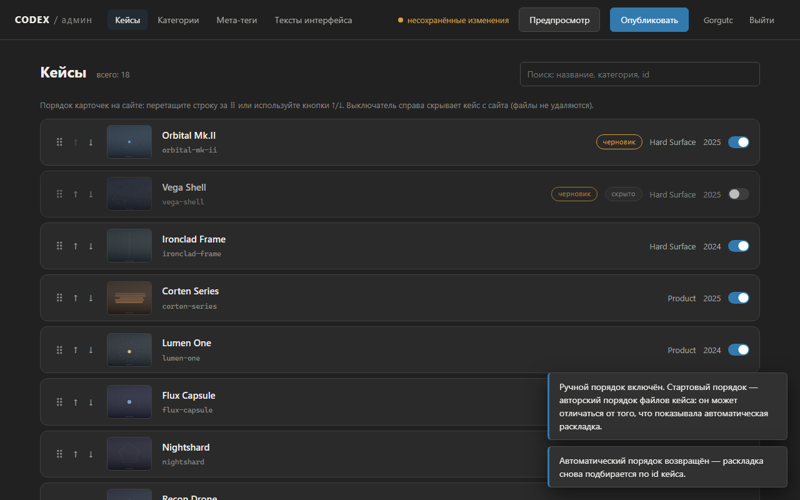

- **Один кейс**: в списке кейсов щёлкните выключатель справа в строке.
  Строка затемнится и получит бейдж «скрыто». После публикации кейс исчезнет
  с сайта (и из поисковой разметки), но **файлы не удаляются** — включите
  выключатель обратно, и кейс вернётся.
- **Категория целиком**: раздел «Категории» → выключатель напротив категории.
  С сайта пропадут и кнопка-фильтр, и все кейсы категории. Сами кейсы при
  этом не трогаются — их собственные выключатели остаются как были.

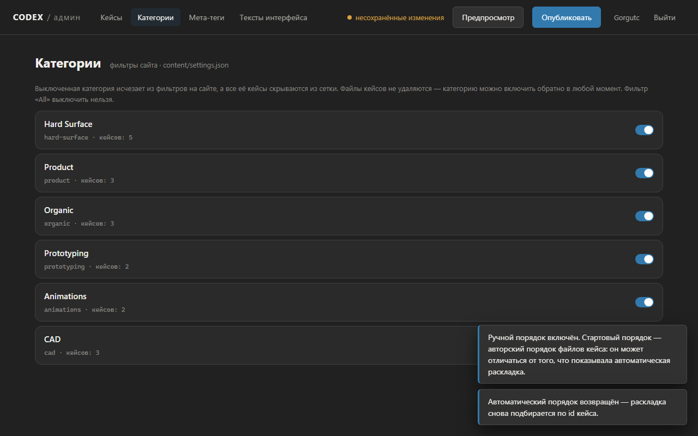

Защита от случайностей: нельзя скрыть последний видимый кейс и нельзя
выключить фильтр «All» — админка вежливо откажет.

---

## 6. Предпросмотр, публикация и откат

### Мета-теги и картинки для соцсетей

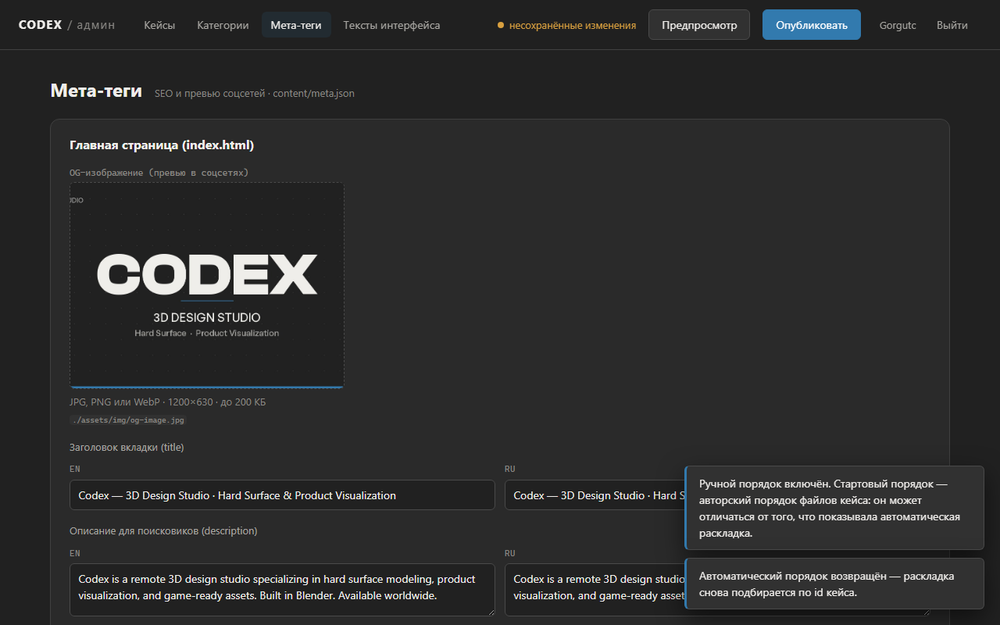

В разделе «Мета-теги» правятся заголовки вкладок, описания для поисковиков
и картинки-превью для соцсетей (OG). Картинку лучше готовить размером
1200×630.

### Предпросмотр «как будет»

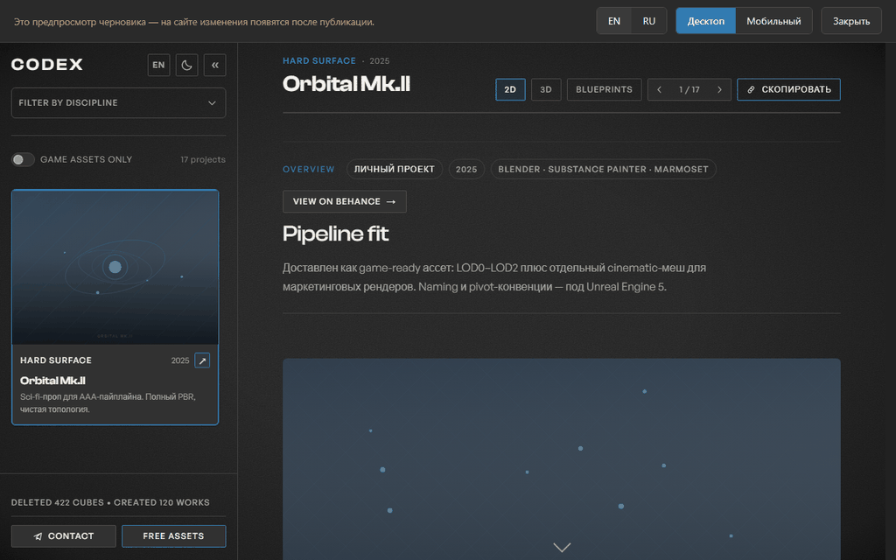

Кнопка **«Предпросмотр»** в шапке показывает настоящий сайт с вашим
черновиком — до публикации. Работает всё: тексты, новые фото (даже ещё не
опубликованные), порядок карточек, скрытые кейсы, 3D-просмотр. Сверху —
напоминание, что это черновик, переключатели RU/EN и «Десктоп/Мобильный»,
кнопка «Закрыть». Особенно полезно после включения ручного порядка блоков —
видно итоговую раскладку.

### Публикация

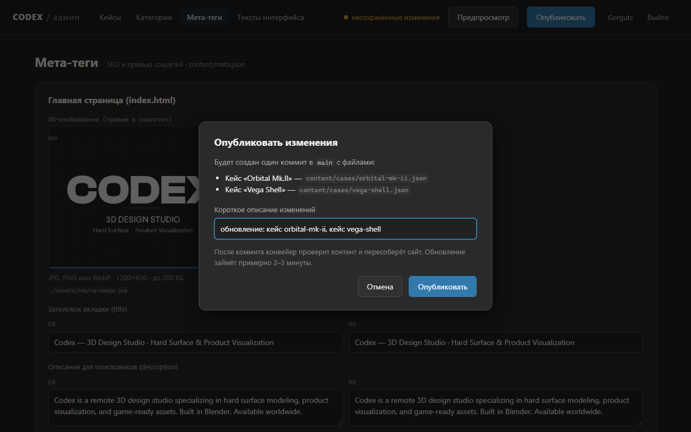

1. Нажмите «Опубликовать». Диалог перечислит, что именно изменилось,
   и предложит короткое описание — поправьте его при желании (по нему потом
   легко найти публикацию в истории).
2. Подтвердите. Дальше всё автоматически: робот проверит контент, пересоберёт
   страницы и выложит сайт. Обычно это занимает 2–3 минуты, админка сама
   сообщит «Опубликовано!».
3. Если проверка нашла проблему, изменения **автоматически откатятся**, сайт
   останется прежним, а тост даст ссылку на детали — ничего страшного не
   произошло, поправьте данные и опубликуйте снова.

### Откат, если опубликованное не понравилось

Два пути, оба безопасные:

- **Netlify (быстрый, в один клик)**: app.netlify.com → ваш сайт → Deploys →
  выберите предыдущий удачный деплой → «Publish deploy». Сайт мгновенно
  вернётся к прошлой версии. Важно: это откат «витрины», данные в репозитории
  остаются новыми — при следующей публикации из админки сайт снова соберётся
  из них.
- **История GitHub (настоящий откат)**: каждая публикация — это запись в
  истории репозитория `Gorgutc/codex` с вашим описанием. На странице
  репозитория → Commits найдите нужную публикацию → кнопка «Revert» в
  интерфейсе GitHub создаст обратную правку. Через пару минут робот
  пересоберёт сайт уже со старым содержимым.

И самое простое: скрыли кейс зря — просто включите его обратно и
опубликуйте ещё раз. Файлы никогда не удаляются, потерять контент нельзя.

---

## 7. Free Assets (каталог бесплатных ассетов)

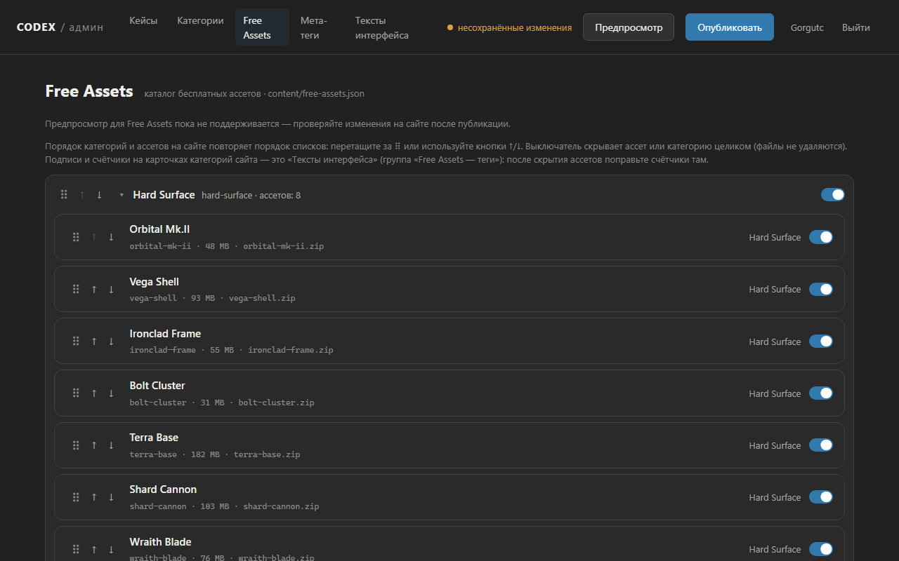

Раздел «Free Assets» управляет каталогом на странице бесплатных ассетов:
группы-категории идут в том же порядке, что и на сайте, внутри — ассеты.

- **Тексты**: кликните по ассету — откроется редактор. Название, бейдж,
  подпись категории, описание EN/RU, список «архив содержит» (строки можно
  добавлять, удалять и переставлять), размер архива (строка как есть,
  например «48 MB») и фон карточки (CSS-градиент с живым образцом).
- **Вкл/выкл**: выключатель справа скрывает ассет с сайта (строка затемнится,
  бейдж «скрыто»); выключатель в шапке группы скрывает категорию целиком —
  с сайта пропадут и её карточка-тег, и галочка в фильтре. Файлы не
  удаляются, всё включается обратно. Последний видимый ассет скрыть нельзя.
- **Порядок**: перетащите ассет или целую категорию за ⠿ (или кнопки ↑/↓) —
  порядок на сайте повторит порядок списка.

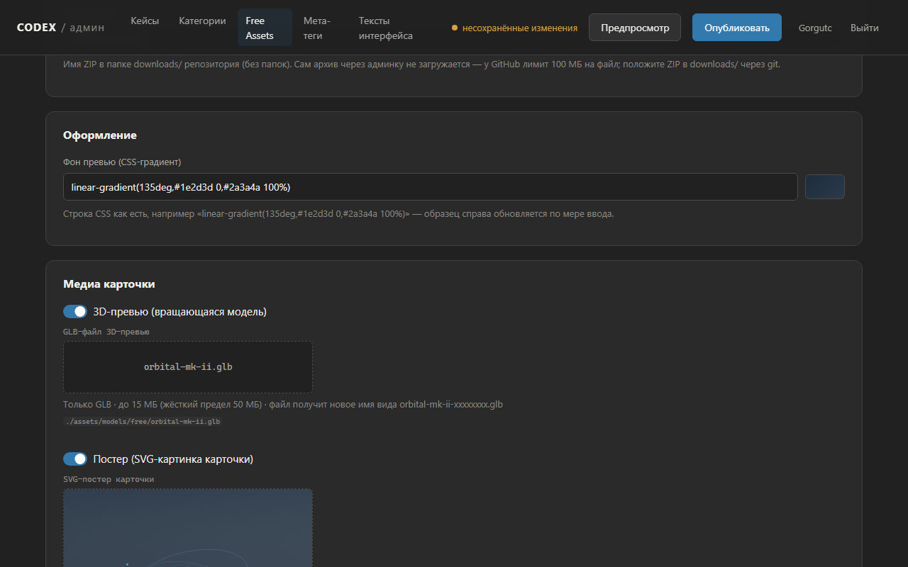

### Замена 3D-превью и постера

- **3D-превью** — вращающаяся модель на карточке. Перетащите новый GLB-файл
  в зону — он получит новое имя автоматически. Тогл выключает 3D совсем
  (карточка покажет постер или фон).
- **Постер** — картинка карточки, **только SVG**: сайт жёстко подставляет
  расширение .svg, другой формат не сработает. У части ассетов постер
  выключен изначально — это нормально.

Два важных ограничения:

- **ZIP-архивы через админку не загружаются**: у GitHub лимит 100 МБ на
  файл. Поле «Файл архива» — это только имя ZIP в папке `downloads/`
  репозитория; сам архив кладётся туда через git.
- **Предпросмотр для Free Assets пока не поддерживается** — проверяйте
  изменения на сайте после публикации (2–3 минуты).

Подсказка: счётчики «8 assets» на карточках категорий сайта пересчитываются
автоматически при публикации — если вы скрыли часть ассетов, число обновится
само, править его вручную не нужно.

---

## Если что-то пошло не так

- **«main изменился, обновите страницу»** — кто-то (или робот) обновил
  репозиторий, пока вы редактировали. Обновите страницу и повторите правки.
- **Жёлтое предупреждение про загруженные файлы** — не перезагружайте
  страницу, пока не опубликуете: загруженные фото/видео живут только
  в памяти вкладки.
- **Публикация «зависла»** — тост даст ссылку на GitHub Actions; обычно
  достаточно подождать. Сайт в любом случае не сломается: до успешной
  проверки он не меняется.
